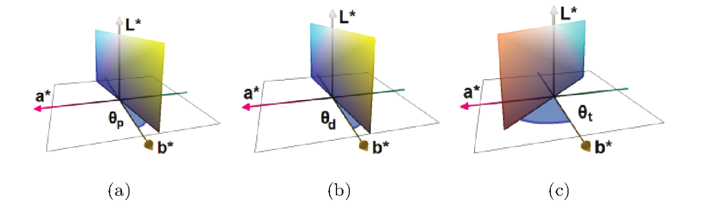
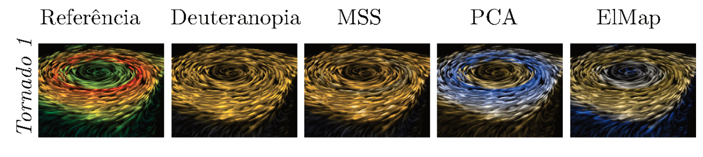

# **Color Vision Deficiency (CVD) Image Recoloring Algorithm**

This repository contains the sources of the acceleration of the Image Recolor for CVD people algorithm using FGPA for the 2022 XACC School.

## **About the algorithm**
This was my graduation final project. We leverage the use of the [Elastic Map](http://bioinfo-out.curie.fr/projects/elmap/) dimensionality reduction technique to develop a novel image recoloring algorithm.

This image recoloring problem is a dimensionality reduction problem. Given that we are working on a 3D space (we mean the color space RGB, L\*a\*b\*, etc), we want to project the pixels of a image in a 2D plane inside this 3D space. The 2D plane represents the part of the space the person with CVD sees in the 3D space. Figure 1 shows the planes for the three types of CVD.

**Figure 1**: (a) represents the protanope plane (&Theta; = -11.48º), (b) represents the deuteranope plane (&Theta; = -8.11º) and (a) represents the tritanope (&Theta; = -46.37º) 

This algorithm uses the L\*a\*b\* colorspace, this space has on one axis the blue to green factor, on another axis the red to yellow factor, while in the last axis (Z) the luminance of the pixel ([Check here](https://en.wikipedia.org/wiki/CIELAB_color_space) for more information). The luminance is a important factor of the pixel we do not wanna change, so, in this algorithm we leave the value of the luminance as it is, and works on the a\* and b\* axis. Since the plane a\*b\* is ortogonal to the CVD planes, we will be reducing the dimensionality from 2 dimensions to 1 dimension. So we will be using the 1D map from the Elastic Maps (a line with a defined number of nodes). This line of nodes (1D map) is then adapted to the existing pixels and then mapped to the CVD plane. Finally, the pixels are projected on the CVD plane in the position of the closest Elastic Map node after the last iteration.

The steps of the algorithm are:
    
* Build the dataset (read the image and construct the data structures)
* Build the elastic map and adapt to the dataset (this takes 7 epochs, more than that causes to much aliasing in the image)
* Center the elastic map on the CVD plane based on the closest node to the origin pixel ({0, 0} on the a\*b\* plane)
* Verify if a inversion is necessary (this is not present in this version, the idea is to invert the elastic map to the CVD plane mapping if the colors got swapped, for example: if blue colors are mapped on green side)
* Project the pixels on the CVD plane (and saves the recolored image)

Figure 2 shows a result from this algorithm. Few points to make here. First, notice how a cvd person would perceive and confuse the colors green/red/yellow. Second, the recolored results of the three techniques are the simulatation of how a deuteranope would see the recolored image. Notice how in ElMap, we have the distinction between the colors the were initially confused.

**Figure 2**: "Referência" means the original image; "Deuteranopia" shows how a deuteranope would see the original image; "MSS" and "PCA" shows state-of-the-art techniques; Finally, "ElMap" shows result of this algorithm

  
If you want to know more about this work, feel free to check the [graduation final project document](https://repositorio.ufsc.br/bitstream/handle/123456789/192338/TCCFinal.pdf?sequence=1) (Unfortunately, it is only available in Portuguese), or feel free to contact me about it (p233687@dac.unicamp.br). 

