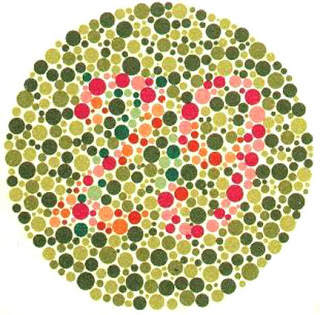

# **HW-Version 1**
This version contains modifications in the kernel. The external loop is unroll by factor 8, the internal can't be unrolled as it does not satisfy dependencies, each loop has a factor 8, so the data bandwidth of 512 is achieved.

## **Results**:

### Experiment Setup:
Experiments are drive in the aws instance and personal PC
* AWS instace: Intel(R) Xeon(R) CPU E5-2686 v4 @ 2.30GHz + UltraScale+ VU9P FPGA
* Personal PC: Intel(R) Core(TM) i5-9300H CPU @ 2.40GHz + GTX 1650 4GB (Runs *CPU* and *GPU* tests)
* **Obs:** The CPU code is single threaded, so the i5 CPU processor has better single-thread perfomance than the Xeon CPU 
* **Obs:** All results are shown in seconds.
* **Obs:** Results for deuteranopes.

| Input Image | Size      | CPU Time (aws) | FPGA Time (aws) | Speed Up   | Original Image | CVD Perception | Result Image (FPGA)| 
| ----------- | --------- | -------------- | ----------------| ---------- | -------------- | -------------- | ------------------ |
| testeimg1   | 500x501   | 4.3478         | 1.9841          |  2.19x     |   |   |   |             
| testeimg2   | 224x225   | 1.0604         | 0.5385          |  1.97x     |   |   |   |             
| testeimg3   | 1280x960  | 21.8649        | 9.0861          |  2.41x     |   |   |   |             
| testeimg4   | 481x321   | 2.8231         |                 |            |   |   | |               
| testeimg5   | 268x166   | 0.8928         | 0.4852          |  1.84x     |   |   |   |             
| testeimg6   | 347x262   | 1.6795         |                 |            |   |   | |              
| testeimg7   | 254x254   | 1.1986         | 0.6368          |  1.88x     |   |   |   |             
| testeimg8   | 220x220   | 0.9513         | 0.5174          |  1.84x     |   |   |   |             
| testeimg9   | 320x316   | 1.8261         | 0.9125          |  2.00x     |   |   |   |            
| testeimg10  | 554x600   | 5.5283         | 2.5889          |  2.14x     |  |  |  |             
| testeimg11  | 200x198   | 0.7911         | 0.4498          |  1.76x     |  |  |  |             
| testeimg12  | 320x315   | 1.8078         | 0.9072          |  1.99x     |  |  |  |             
| testeimg13  | 200x200   | 0.7979         | 0.4594          |  1.74x     |  |  |  |             
| testeimg14  | 320x315   | 1.9063         | 0.9141          |  2.09x     |  |  |  |             
| testeimg15  | 313x320   | 1.8424         | 0.9034          |  2.04x     |  |  |  |             
| testeimg16  | 328x296   | 1.7687         | 0.8833          |  2.00x     |  |  |  |             
| testeimg17  | 6000x4000 | 438.4492       | 175.8575        |  2.49x     |  |  |  |             

**Discussions**: 
* The average speed up is 2.02x. It is a increase, but not as expected. The is a dependency between the inner and external loop that makes the pipeline goes sequential even if there are multiple instances to cumputate. I believe the best option here would be using multiple compute units. But it was not achievable by matters of time in this week.
